# PrepWise — System Flowchart & Algorithm Deep-Dive

This document is meant to be shared with the team and used as a base for the final report / documentation. It covers the full request flow as a diagram, followed by a detailed breakdown of every algorithm used in the backend.

---

## 1. Full System Flowchart

```mermaid
flowchart TD
    A[Candidate selects skills + starting level] --> B["POST /api/interviews<br/>skill_ids[], starting_level"]
    B --> C[Express: startInterview]
    C --> C1[Validate skills + starting_level]
    C1 --> C2["Convert starting_level → target difficulty<br/>easy=0.2 mid=0.5 expert=0.85"]
    C2 --> C3["Query question_bank:<br/>closest difficulty match across ALL selected skills"]
    C3 --> C4[Create Interview row]
    C4 --> C5[Link interview to all selected skills<br/>via interview_skills join table]
    C5 --> C6["Seed InterviewSkillProgress row<br/>PER selected skill, all at target difficulty"]
    C6 --> C7[Create first Question row]
    C7 --> D[Return first question to frontend]

    D --> E[Candidate records audio answer]
    E --> F["POST /api/questions/:id/answer<br/>multipart audio file"]
    F --> G[Express: submitAnswer]

    G --> H["Send audio to Whisper STT service<br/>Contract A"]
    H --> H1["Returns: transcript_text + confidence_score"]

    H1 --> I["Look up reference_answer + keywords<br/>from CSV, keyed by question_bank id"]

    I --> J["Send to NLP Scoring Service<br/>Contract B"]
    J --> J1["transcript_text, reference_answer,<br/>keywords, confidence_score"]
    J1 --> K["NLP returns:<br/>keyword_score, tfidf_score, semantic_score,<br/>final_score, strengths, weaknesses,<br/>areas_for_improvement"]

    K --> L[Save Answer row in Postgres]

    L --> M["Find InterviewSkillProgress row<br/>for THIS question's skill only"]
    M --> N["adjustDifficulty(currentDifficulty, final_score)<br/>DDA algorithm"]
    N --> O[Update that skill's current_difficulty<br/>+ increment questions_asked]

    O --> P["pickNextQuestion:<br/>Round-robin across all selected skills"]
    P --> P1["Pick skill with FEWEST questions_asked so far"]
    P1 --> P2["Within that skill, pick closest-difficulty<br/>UNASKED question"]
    P2 --> Q{Question found?}

    Q -->|Yes| R[Create next Question row]
    R --> S[Return evaluation + next_question to frontend]
    S --> E

    Q -->|No more questions<br/>for any skill| T[Frontend prompts: End Interview]
    T --> U["POST /api/interviews/:id/end"]
    U --> V[Express: set status = completed<br/>NLP /interview/end is NOT called]

    V --> W["GET /api/interviews/:id/report"]
    W --> X["For each skill:<br/>read final InterviewSkillProgress.currentDifficulty"]
    X --> Y["difficultyToLevel(difficulty)<br/>→ assessed_level: easy/mid/expert"]
    Y --> Z["Return per-skill breakdown:<br/>assessed_level, avg_score, all Q&A + feedback"]
```



---

## 2. Algorithm Deep-Dive #1 — Round-Robin (Least-Served-First) Question Selection

### The problem
When a candidate selects multiple skills (say React, SQL, System Design), and the system just pools all their questions together and always picks the single closest-difficulty match, **one skill can dominate** the entire interview while another gets zero coverage — purely because its question bank happens to have better difficulty matches at that moment. That's unfair to the candidate's intent (they picked 3 skills expecting to be tested on all 3).

### The concept it borrows from
This is a form of **round-robin scheduling** — a technique from CPU process scheduling and network packet scheduling, where multiple competing "flows" take turns using a shared resource, instead of one flow monopolizing it. PrepWise uses a variant called **least-served-first** (related to Weighted Fair Queuing / Least-Connection load balancing): instead of a rigid fixed cycle (skill 1 → 2 → 3 → 1 → 2 → 3...), it dynamically checks *who has had the fewest turns so far* and gives that one priority.

### The actual logic
```javascript
export const pickNextQuestion = async ({ interviewId, skillIds }) => {
  const progressRows = await progressRepository().find({
    where: { interview: { id: interviewId }, skill: { id: In(skillIds) } },
    relations: { skill: true },
  });

  // Step 1: find the LEAST-served skill
  const nextProgress = progressRows.slice()
    .sort((a, b) => a.questionsAsked - b.questionsAsked)[0];

  // Step 2: within that skill, find the closest-difficulty question
  // that hasn't been asked yet in this interview
  const askedBankIds = /* ...all question_bank ids already used... */;

  const nextQuestionBank = await questionBankRepository()
    .createQueryBuilder("qb")
    .where("qb.skill_id = :skillId", { skillId: nextProgress.skill.id })
    .andWhere("qb.id NOT IN (:...askedBankIds)", { askedBankIds })
    .orderBy("ABS(qb.difficulty_level - :target)", "ASC")
    .addOrderBy("RANDOM()")
    .setParameter("target", Number(nextProgress.currentDifficulty))
    .getOne();

  return { nextQuestionBank, progress: nextProgress };
};
```

### Walking through an example
Say the candidate picked React, SQL, and System Design, starting at "mid" (0.5):

| Turn | questions_asked (React, SQL, SysDesign) | Who goes next? |
|---|---|---|
| 1 (seed) | React gets the very first question (closest overall match) | React: 1, SQL: 0, SysDesign: 0 |
| 2 | SQL and SysDesign are tied at 0 (lowest) | SQL wins the tiebreak (arbitrary array order) |
| 3 | React: 1, SQL: 1, SysDesign: 0 | SysDesign (lowest) |
| 4 | All tied at 1 | Whichever is first in the sorted array |

This guarantees that across N questions, every selected skill gets roughly `N / number_of_skills` questions — none gets starved, regardless of how the candidate performs.

### Why `RANDOM()` matters as a tiebreaker
Without it, `ORDER BY ABS(difficulty - target) ASC LIMIT 1` has **undefined tie behavior** in SQL — when multiple questions tie on distance from target, Postgres returns whichever one it encounters first based on internal storage/index order. This can *look* deterministic (same result every time you test) purely because the underlying table isn't changing — but it's not a real guarantee, and it could silently shift after a `VACUUM`, reindex, or new insert. Adding `RANDOM()` makes the tie-breaking intentional and fair instead of accidentally-stable.

---

## 3. Algorithm Deep-Dive #2 — Dynamic Difficulty Adjustment (DDA)

### The problem
A fixed-difficulty test wastes questions: if someone is clearly strong, asking them easy questions tells you nothing new; if someone is struggling, asking them expert questions just frustrates them without revealing their actual level. A **good adaptive test converges toward the candidate's true ability** as quickly as possible.

### The concept it borrows from
This is the core idea behind **Computerized Adaptive Testing (CAT)** — used in real standardized tests like the GRE and GMAT, and in language-learning apps like Duolingo. The general CAT principle: after each answer, re-estimate the candidate's ability and select the next question to match that new estimate.

The "textbook" way to do this is **Item Response Theory (IRT)** — a statistical model that estimates a continuous ability parameter using probability curves calibrated against large item banks. PrepWise deliberately uses a **simpler, more explainable staircase/bucket approach** instead — appropriate given the smaller question bank and much easier to justify and explain in a report/viva without needing IRT's heavy statistical machinery.

### The actual logic
```javascript
export const LEVEL_TO_DIFFICULTY = { easy: 0.2, mid: 0.5, expert: 0.85 };

export const adjustDifficulty = (current, finalScore) => {
  let delta;
  if (finalScore >= 0.75) delta = 0.2;    // strong answer → jump up
  else if (finalScore >= 0.55) delta = 0.05;  // decent → small nudge up
  else if (finalScore >= 0.35) delta = 0.0;   // middling → hold steady
  else if (finalScore >= 0.2) delta = -0.1;   // weak → step down
  else delta = -0.2;                          // very weak → drop hard

  const next = current + delta;
  return Math.min(1.0, Math.max(0.0, next)); // clamp to valid [0,1] range
};
```

### Why 5 bands specifically, and why asymmetric deltas
- The bands cover the full `[0, 1]` score range with no gaps.
- The deltas are **asymmetric on purpose**: the "climb" deltas (+0.2, +0.05) are more cautious near the top, while the "drop" delta at the bottom (-0.2) is aggressive. This reflects a common adaptive-testing design instinct: it's better to quickly find a candidate's *floor* when they're clearly struggling (avoid wasting their time on questions way above their level) while climbing more conservatively at the top (avoid overshooting into unreasonably hard territory off one lucky good answer).
- The `0.35–0.54` "stability zone" (delta = 0) prevents oscillation — without it, a candidate hovering right at a threshold could bounce difficulty up and down erratically question to question.

### Why this must run PER SKILL, not once per interview
This was a real bug caught during development: difficulty was originally stored once on the whole `Interview` row. That meant a bad answer on a System Design question would incorrectly lower the difficulty of the *next React question too* — even though the candidate hasn't answered anything in React yet. The fix: a separate `InterviewSkillProgress` row per `(interview, skill)` pair, each with its own `current_difficulty`, updated independently:

```javascript
const answeredSkillId = question.questionBank.skill.id;
const progress = /* find InterviewSkillProgress WHERE interview_id = X AND skill_id = answeredSkillId */;
progress.currentDifficulty = adjustDifficulty(Number(progress.currentDifficulty), nlp.final_score);
progress.questionsAsked += 1;
```

This means performance in one skill has **zero effect** on the difficulty trajectory of any other skill in the same interview — each skill gets its own honest, independent adaptive assessment.

---

## 4. Algorithm Deep-Dive #3 — NLP Answer Scoring (owned by the NLP microservice)

This part runs entirely inside the FastAPI service, but it's worth documenting since Express depends on its output. Three independent signals are computed per answer, then combined:

### a) Keyword Matching
Checks whether specific required terms (with **tiers** — critical vs supporting — and **aliases**, e.g. `"caching"` also matches `"cache"` or `"caching layer"`) appear in the transcript. Includes:
- **Fuzzy matching** (edit-distance ratio) to tolerate minor Whisper transcription errors or misspellings
- **Negation detection** (word-window lookback) to avoid crediting a term that was actually negated (e.g. *"it's not about caching"* shouldn't score as if "caching" was correctly used)
- **Rarity weighting** — rarer, more specific terms across the question bank count for more than common generic ones

### b) TF-IDF Cosine Similarity
A classic information-retrieval technique: represents both the transcript and the reference answer as weighted term-frequency vectors (where rarer terms across the corpus get more weight — Term Frequency–Inverse Document Frequency), then measures the cosine of the angle between those two vectors. Good at catching lexical overlap, but doesn't understand paraphrasing or meaning.

### c) Semantic Similarity (SBERT)
Uses a Sentence-BERT embedding model to convert both texts into dense vector representations that capture *meaning*, not just word overlap, then compares them via cosine similarity. This is what catches a correct answer phrased in completely different words than the reference — something pure keyword/TF-IDF matching would miss entirely.

### d) Final Score
A weighted combination of the three signals above (weights configured in the NLP service's `config.py`), producing the single `final_score` that Express feeds into `adjustDifficulty()`. This is also where the `strengths` / `weaknesses` / `areas_for_improvement` feedback text gets generated for the candidate.

---

## 5. Algorithm Deep-Dive #4 — Final Report Generation

### The problem
A single overall percentage score hides more than it reveals in an adaptive system. A candidate who scored 60% while being asked *expert*-level questions and a candidate who scored 60% on *easy*-level questions are not performing at the same level — but a flat average makes them indistinguishable.

### The insight
Because difficulty is **adaptive**, the difficulty level a skill *settles at* by the end of the interview already **is** a meaningful estimate of the candidate's ability in that skill — that's the entire point of the DDA algorithm running throughout. So instead of computing one new "final score," the report simply reads off where each skill's difficulty trajectory ended up:

```javascript
export const difficultyToLevel = (difficulty) => {
  if (difficulty >= 0.7) return "expert";
  if (difficulty >= 0.4) return "mid";
  return "easy";
};
```

For each skill, the report combines:
- `final_difficulty_reached` — the raw ending difficulty number
- `assessed_level` — that number converted to a human label via `difficultyToLevel`
- `average_score_at_that_level` — the average `final_score` across that skill's answers, included as **supporting context** (how well they did at the level they were placed at), never as the headline metric
- Full per-question breakdown — transcript, individual scores, and the qualitative feedback generated by the NLP service

### Why the NLP service's own `/interview/{id}/end` averaging endpoint is deliberately unused
That endpoint only computes one flat average across every question in an `interview_id`, with no concept of skills or difficulty. Since PrepWise's real result needs to be grouped per skill using data that only exists in Postgres (`InterviewSkillProgress`), Express builds its own report from the individual `/score/answer` results it already saved, rather than relying on that aggregate endpoint. This is intentional layering: **the NLP service scores one answer at a time; Express — which owns the interview/skill data model — is responsible for aggregation.**

---

## 6. One-Paragraph Summary (for the report abstract)

> PrepWise conducts spoken mock interviews across one or more candidate-selected skills. Each answer is transcribed via Whisper, scored by an independent NLP microservice using keyword, TF-IDF, and semantic (SBERT) similarity against a reference answer, and combined into a final score. A per-skill Dynamic Difficulty Adjustment algorithm — a simplified, explainable variant of the Computerized Adaptive Testing principle used in tests like the GRE — then raises or lowers that skill's difficulty based on performance, independently across all selected skills. A least-served-first round-robin scheduler ensures fair question coverage across all selected skills. The final report derives each skill's assessed level directly from where its difficulty trajectory converged, rather than from a flat score average, giving a more accurate picture of the candidate's true per-skill ability.
