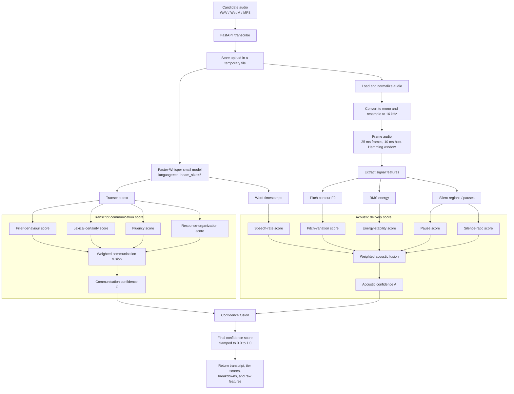
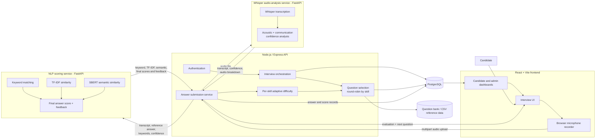
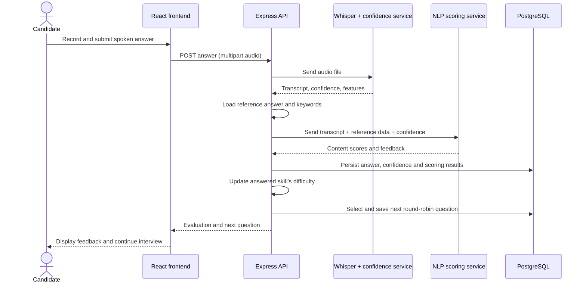
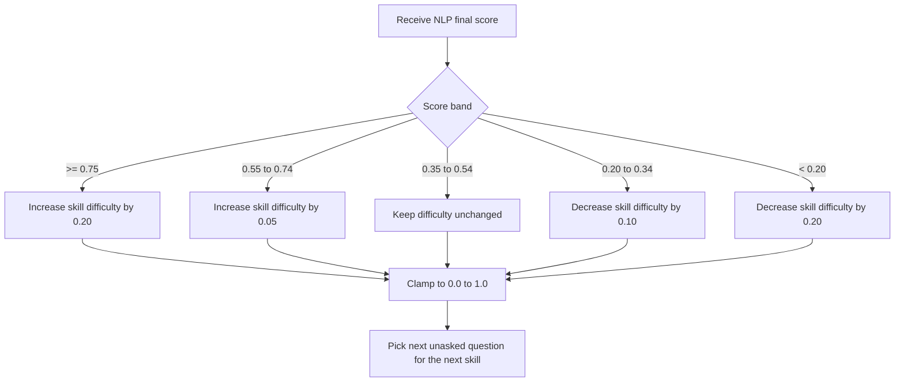

# Evaluation System Charts

These charts reflect the services and algorithms currently implemented in this
repository. They are written in Mermaid so they remain version-controlled,
editable, and render in GitHub, GitLab, and Mermaid-compatible documentation
viewers.

## Whisper transcription and confidence-analysis algorithm



### Confidence scoring model

| Tier | Measures | Weights within tier |
|---|---|---|
| Acoustic delivery | Speech rate, pauses, pitch variation, energy stability, silence ratio | 25/70, 20/70, 10/70, 10/70, 5/70 |
| Communication | Filler behaviour, lexical certainty, fluency, response organization | 10/30, 8/30, 7/30, 5/30 |

The current implementation calculates the final score as:

```text
confidence = acoustic + (communication - acoustic) * 0.30
           = 0.70 * acoustic + 0.30 * communication
```

This produces a score from `0.0` to `1.0`; it is an indicator of delivery and
communication confidence, not a measure of subject-matter correctness.

## Whole-system architecture



## Answer-processing sequence



## Adaptive difficulty decision chart


